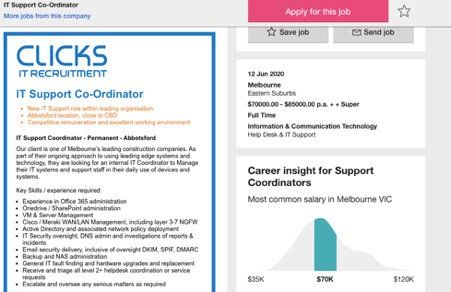
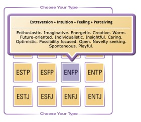
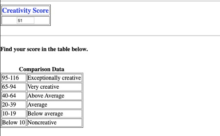

<h1>Introduction</h1>
<p1> Timothy Rosewarne  								S3864775  
S3864775@student.rmit.edu.au    

I am Australian and was born in Brisbane. Previous to this course, I completed year 12 and have since worked in the dredging industry. In 2019 I worked at Mt. Hotham during the snow season, which was a very different experience for me. I really enjoyed my time at the snow and it allowed me to finally move out of home. After the season concluded, I moved down to Melbourne and am really enjoying the change, especially the colder weather. I have always wanted to learn another language, preferably Italian or Japanese. I absolutely love animals and find all kinds fascinating. My favourite animal is either a White Tiger or a Capuchin Monkey. My favourite sport is basketball, but I really love any sport. Growing up I played rugby league for 11 years and have always enjoyed playing different sports socially. </p1>

<h2>Interest in IT</h2>
<p2> I am interested in IT because it is always growing and changing to become better and to make everyday life tasks even easier. I find it so fascinating how we can use devices and machines in such a broad way to help us complete and learn so many different things. IT has always been great source of entertainment for me whether it be music, television or playing video games. I have been interested in IT ever since I was a young kid and playing a lot of video games. I am looking forward to learning more about the mechanics and gain a more in depth knowledge of hardware and software. I don’t have a lot of experience in the IT industry, only what I have previously studied at school, or the tech I use at home such as computers, gaming devices, mobile phones and using POS in retail. 

I am studying through Open University’s Australia which offered me a range of different IT degrees from many universities. RMIT has a great reputation in the IT field and for that reason, I was drawn to studying here. Friends who have completed their degrees at RMIT have reported to me that they received great training, which set them up for their careers in IT. I also enjoy that RMIT offers different specialisations within the degree so I have the option to make my university experience specific to my needs and interests. 

I expect to learn a lot more about the IT industry as a whole, whether it is learning about hardware parts for machines or PCs, software such as programs that are useful for coding or designing websites and learning all of the aspects of the software and how to use them properly. I also want to learn more about coding and how it works and general “smart home” technology. Through learning about all of these different areas, I expect that I will be able to make a decision about which area I am the most interested in and what I need to know to work the field. </p2>

<h2>Ideal Job</h2>

<link>https://www.seek.com.au/job/50084345?type=standout#searchRequestToken=ab6f5196-1126-4129-aa42-400dd02561d2</link>

  
IT support co-ordinators are responsible for developing, organising and implementing a company’s IT goals. They can provide the organisation general support duties such as monitoring computer performances, providing and installing updates on the work systems, installing software for the technology and could also work on fixing hardware issues. I find this position appealing because I would be able to monitor the companies systems in real time, and fix any issues that arise. I enjoy problem solving tech issues and determining whether it is a hardware or software issue. This job also contains an administrative and managerial side, which I could see myself being successful with as I enjoy working with others and in a team environment. 

Typically, people hired for this job have completed a Bachelor in computer or information science for the mathematics, software development and programming skills required. Not only does it require you to have good knowledge about technology and software, but you will also need to be a good leader with strong communication and organisation skills.

I believe I have good communication skills, however, currently do not have the technology skills yet, which is why I have decided to do this Bachelor of IT. This course and the knowledge and skills taught within it are going to assist me in being able to reach my goal. Further I will work on honing leadership skills throughout the course and beyond to further cement my abilities. 

<h1>Personal Profile</h1>
 
<h2>Myers-Briggs</h2>  
  
<h2>Learning Style test</h2>
Your Scores:  
•	Auditory: 45%  
•	Visual: 30%  
•	Tactile: 25%  
You are an Auditory learner!  

Auditory  
<p3> If you are an auditory learner, you learn by hearing and listening. You understand and remember things you have heard. You store information by the way it sounds, and you have an easier time understanding spoken instructions than written ones. You often learn by reading out loud because you have to hear it or speak it in order to know it.
As an auditory learner, you probably hum or talk to yourself or others if you become bored. People may think you are not paying attention, even though you may be hearing and understanding everything being said.
Here are some things that auditory learners like you can do to learn better. </p3>  
•	Sit where you can hear.  
•	Have your hearing checked on a regular basis.  
•	Use flashcards to learn new words; read them out loud.  
•	Read stories, assignments, or directions out loud.    
•	Record yourself spelling words and then listen to the recording.  
•	Have test questions read to you out loud.  
•	Study new material by reading it out loud.  
Remember that you need to hear things, not just see things, in order to learn well.  
<h2> Creativity Test</h2>  

Whilst tests such as the Myer-Briggs, learning style and creativity, are not always 100 percent accurate, I have found that these results are a reasonable accurate reflection of my personality, work ethic and how well I would work as part of a team.
The results of the Myer Briggs test show that I am energetic, person-centred, creative and enthusiastic. In a team, this means that I can bring energy and a new way of thinking into the group, in order to maintain group morale when projects become difficult. Further, the creativity test shows that I have above average creativity, which means that I can bring new ideas and suggestions to the group which have not been considered yet.  The results of the learning test show that I am a good auditory learner, which in the group environment means that I will listen to others and learn from them. I also have the ability to learn whilst listening and completing other tasks which will help the group move faster. I believe these characteristics of my personality highlight my strength within a group and prove I am an asset to any team. I will take the results of these tests into account when I am forming a team for group projects. In doing so, I will aim to find other individuals who have learning styles or personalities that are going to work well with mine to make the task as easy as it can be for us all as a team.  

<h1>Project Idea</h1>
My project, Infoto, is a mobile app that will allow the user to take a photo of an object such as food, sporting equipment or anything they unsure of the name of or use of it. Infoto will search web for the item and retrieve information about it such as what the item is called, a description of what the item does or is used for and a suggestion to where you might be able to find one or buy one. For example, Benjamin might take a photo of an unusual bird he has never seen before. Infoto will browse the web and provide him with information such as the breed and the birds native land. 
 
Infoto is interesting and useful because often, people find it difficult to describe an object and receive accurate information as to what it is from the internet. This app will allow users to take a photo and allow the app to do the hard work for them. The app allows users to save time on searching for accurate results and get back to their day. This app allows people to maintain their curiosity about the world and have access to the answers, at their fingertips. 
 
Infoto gives the user the option to take a photo of an object and upload it to the app and lets the app do the searching for you. This will save time for many busy people as they will not have to spend their time searching the web and thinking of words to describe the item, with little to no results. Infoto allows people to get on with their day. For children, Infoto is perfect. It gives access to a world of curiosity, opening a young child’s mind to creativity and curiosity. Children have the tendency to ask their parents a million questions and it is not often that us adults know the answers. Infoto does! Infoto gives the user the name of an object, place or landmark, a detailed description, interesting facts and if possible, where they would be able to buy one. If the photo is of a place, Infoto can also give directions or link the individual to a travel agent website. Technology is advancing quickly and is an integral part of our future. It is estimated that in 2020 there are 18.44 million smart phone users in Australia. This is set to rise to 19.27 million users by 2022. These statistics show the potential outreach this mobile application has. https://www.statista.com/statistics/467753/forecast-of-smartphone-users-in-australia/. The goal of Infoto is to educate people about the everyday things around them and to give people a better understanding of the world, objects and how to use them or their purpose. As well as educating the user, Infotos suggestions function will assist in identifying where you could buy one, how much do they cost, where would you find one, websites they could buy them online from, when were they made/discovered and so much more. Infoto will store any photo you take and put it in a library. This permits the user will be able to quickly take a photo and search for it later, if they are too busy. This will also prove useful if you want to show someone information about an item you have already searched. Infoto will also contain security and age and family friendly filters so that explicit content cannot be searched without permission. 
 
The Infoto app will be free to download and will give companies the opportunity to advertise through it. A No-Cost app will increase the popularity and get the brand name out, encouraging consumers to recommend the app to others. Companies to may benefit from the app such as travel agents and purchasing stores will pay to advertise on the app if they want their brand to appear first in the search results, or have additional advertising through the app, similar to other apps you may see today. Infoto will have a paid option to remove ads from the feed, if the consumer wishes to, similar to many apps already developed.   
In order to make this project possible, Infoto will require to be developed using a platform to build the app on such as Xcode for iOS, eclipse for Andriod or other cross platform tools as these are the most popular platforms to use. Xcode is a great tool to use as it allows users to design and test user interface without writing any code, When you make a coding mistake, Xcode will alert you straight away, and a single keyboard shortcut will instantly fix the issue saving a lot of time for coding, the asset catalogue will allow the user to store and manage their images and keep it efficient. To get the name and branding of Infoto out, it will need to be advertised somewhere such as online, advertised in the app store and on other apps or in a magazine. Similar to other apps especially with reviews on the play store or app store we will be able to determine any feedback ideas and be able to work around them to fix issues or improve the app. Tools such as Google Analytics and Localytics allows developers to track how consumers are using the app and what they aren’t using or what areas need to be improved and which areas are working well.  
<link>Analytics.google.com</link>  
<link>https://developer.apple.com/xcode/features/</link>  
In order to make Infoto come to life, the developer will have to have many skills such as the ability to create mobile apps, hardware and software knowledge. In order for the app to run smoothly and efficiently, the developer will develop a program to get the camera to scan any object and then link the photo with a written description of the closest match to the photo on the web, or link to websites to buy from and bringing up a map of the closest place to find the object if the user requests it. Infoto to show them where to go for that item. The technical skills the developer will need would include a strong knowledge of the iOS and Android Platforms, User interface and user experience design skills, web service design experiences including reliability, security and scalability. They would also require experience in information security, understanding of access management and excellent oral and written communication skills to be able to work with customers. With my current skill set, I could see myself running into many issues due to my current limited knowledge. Engaging with a team of app developers who are skilled in this area would be of great benefit to me, and feasible in order to get the program up and running. I would need to further improve my skills in Project management, app design skills, coding skills, security and user interface and user experience features as they are very important for creating any app.
When Infoto comes to life, we would have a fully functioning, easy to use mobile platform which will educate people about whatever they are interested in learning about. It will also encourage people to be more curious about certain things rather than just walking past it if they don’t know what it is. Today’s society is busy, we do not have time to waste thinking about descriptive words to google while the children are asking hundreds of questions. Infoto will be able to answer all of our questions at a touch of a button, giving us more time to spend with family and friends, and less time on our phones. 

<h1>References</h1>  
Myers briggs personality test
<link>https://www.myersbriggs.org/my-mbti-personality-type/mbti-basics/</link>

Education planner – Learning style quiz
<link>http://www.educationplanner.org/students/self-assessments/learning-styles-quiz.shtml?event=results&A=9&V=6&T=5</link>

Kellogg Brian Uzzi Creativity Test <link>https://www.kellogg.northwestern.edu/faculty/uzzi/ftp/page176.html</link>

Applico – Alex Moazed 2020 Tools for building an app <link>https://www.applicoinc.com/blog/essential-tools-for-building-a-mobile-app/ </link>

Google Analytics Analytics.google.com

Xcode IDE <link>https://developer.apple.com/xcode/features/</link>

